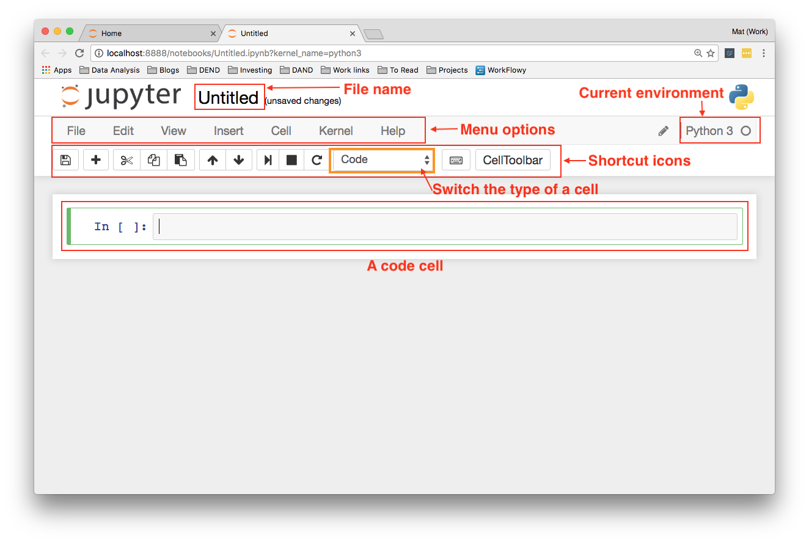

# Jupyter Notebooks

Jupyter Notebooks is a web application that allows you to combine explanatory text, math equations, code, and visualizations all in one easily sharable document.

Notebooks are a form of [literate programming](http://www.literateprogramming.com/) proposed by Donald Knuth in 1984. With literate programming, the documentation is written as a narrative alongside the code instead of sitting off by its own. In Donald Knuth's words:

> *Instead of imagining that our main task is to instruct a computer what to do, let us concentrate rather on explaining to human beings what we want a computer to do.*

Example notebooks:
- [binary black hole signals in LIGO open data](https://www.gw-openscience.org/GW150914data/LOSC_Event_tutorial_GW150914.html)
- [Gravitational Wave Open Science Center](https://www.gw-openscience.org/tutorials/)
- [Neural Networks tutorial](https://nbviewer.jupyter.org/github/masinoa/machine_learning/blob/master/04_Neural_Networks.ipynb)

## Installation

Jupyter Notebooks comes pre-installed with Anaconda. Otherwise you an use pip or conda to install:

```sh
# First, verify if you have Python and conda installed
# If the command below shows an error, try installing it first using `conda install python=3`
python --version
conda --version

# Use either of the commands below to install notebook
conda install jupyter notebook
conda install -c conda-forge notebook
```

If you are using pip, you can install Jupyter notebook with:

```sh
# First, verify if you have pip installed. In recent versions of Python 2 >=2.7.9 or Python 3 >=3.4, pip comes preinstalled.
# If the `pip` command below shows an error, try installing pip from https://pip.pypa.io/en/stable/installing/
python --version
pip --version


# Use either of the commands below to install notebook
pip install notebook
pip install jupyter notebook
```

### Notebook Conda Package

Manage conda environments within Jupyter. To install run:
```sh
conda install nb_conda
```

## Start

To start Jupyter server in the current directory:

```sh
jupyter notebook
```

[What to do when things go wrong?](https://jupyter-notebook.readthedocs.io/en/stable/troubleshooting.html#what-to-do-when-things-go-wrong)




### Code Cells

Most of your work in notebooks will be done in code cells. This is where you write your code and it gets executed. In code cells, you can write any code, assigning variables, defining functions and classes, importing packages, and more. Any code executed in one cell is available in all other cells.

### Markdown Cells

Markdown is a formatting syntax that allows you to include links, style text as bold or italicized, and format code.

- [Github markdown cheatsheet](https://guides.github.com/pdfs/markdown-cheatsheet-online.pdf)
- [Cheatsheet by Adam Pritchard](https://github.com/adam-p/markdown-here/wiki/Markdown-Cheatsheet)

#### **Math Expressions**

You can create math expressions in Markdown cells using LaTeX symbols. Notebooks use MathJax to render the LaTeX symbols as math symbols. To start math mode, wrap the LaTeX in dollar signs `$y = mx + b$` for inline math. For a math block, use double dollar signs:

```
$$
y = \frac{a}{b+c}
$$
```

[Latex Tutorial](https://www.latex-tutorial.com/)


## Keyboard Shortcuts

Jupyter Notebooks have two different keyboard input modes:

- **Command mode** - binds the keyboard to notebook level actions. Indicated by a grey cell border with a blue left margin.
- **Edit mode** - when you’re typing in a cell. Indicated by a green cell border

#### **Command Mode**

- `shift` + `enter` run cell, select below
- `ctrl` + `enter` run cell
- `option` + `enter` run cell, insert below
- `A` insert cell above
- `B` insert cell below
- `C` copy cell
- `V` paste cell
- `D` , `D` delete selected cell
- `shift` + `M` merge selected cells, or current cell with cell below if only one cell selected
- `I` , `I` interrupt kernel
- `0` , `0` restart kernel (with dialog)
- `Y` change cell to code mode
- `M` change cell to markdown mode (good for documentation)

#### **Edit Mode**

- `cmd` + `click` for multi-cursor editing
- `option` + `scrolling click` for column editing
- `cmd` + `/` toggle comment lines
- `tab` code completion or indent
- `shift` + `tab` tooltip
- `ctrl` + `shift` + `-` split cell

#### **Command Palette**

`cmd` + `shift` + `p` to access to all the commands in Jupyter Notebooks.

[Jupyter Python Notebook Keyboard Shortcuts and Text Snippets for Beginners](http://maxmelnick.com/2016/04/19/python-beginner-tips-and-tricks.html)


## Magic Keywords

Magic keywords are special commands you can run in cells that let you control the notebook itself or perform system calls such as changing directories. For example, you can set up matplotlib to work interactively in the notebook with `%matplotlib`.

Magic commands are preceded with one or two percent signs (`%` or `%%`) for **line magics** and **cell magics**, respectively. Line magics apply only to the line the magic command is written on, while cell magics apply to the whole cell.

[List of Magic Commands](https://ipython.readthedocs.io/en/stable/interactive/magics.html)


## Convert Notebooks

Notebooks are just big JSON files with the extension `.ipynb`. Convert notebooks using `nbconvert`:

```sh
jupyter nbconvert --to FORMAT mynotebook.ipynb
```

The currently supported output FORMAT could be either of the following (ignore case):

- HTML
- LaTeX
- PDF
- WebPDF
- Reveal.js HTML slideshow
- Markdown
- Ascii
- reStructuredText
- executable script
- notebook